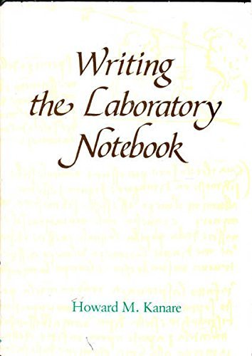

# Lab Journal


A structured engineering lab journal adapted from laboratory notebook practices in the physical sciences. Drop it into any project to give AI agents (and humans) a disciplined session-logging workflow.

## Why?

Software engineering sessions — especially AI-assisted ones — produce a stream of decisions, experiments, failures, and fixes that commit messages alone can't capture. A lab journal provides:

- **Reproducibility.** Enough context to re-derive any decision.
- **Accountability.** Signed, dated, immutable records.
- **Continuity.** Future sessions (or collaborators) can pick up where you left off.
- **Learning.** Failures and dead ends are valuable — but only if recorded.

## Method

This journal follows the principles in:

> **Kanare, Howard M.** *Writing the Laboratory Notebook.* Washington, DC: American Chemical Society, 1985. ISBN 978-0-8412-0906-4.



**Permanence.** Entries are append-only. Never delete or rewrite history. Add dated corrections referencing the original.

**Immediacy.** Record as you work, not from memory afterward.

**Self-containment.** Each entry stands alone. A reader unfamiliar with the project should understand what was attempted, what happened, and what was concluded.

**Completeness.** Record *what happened*, not *what you wish had happened*. A properly recorded failure saves future researchers from repeating it.

**Witnessing.** Every entry is signed, dated, and linked to verifiable artifacts (git commits, issue IDs).

## Setup — Adding Lab Journal to Your Project

### Step 1: Copy three things into your project

```
your-project/
├── CLAUDE.md            # paste the agent instructions (step 2) into this file
└── lab-journal/
    ├── index.md         # master table of contents
    └── TEMPLATE.md      # entry template
```

From this repo, copy:

1. **`lab-journal/TEMPLATE.md`** — the entry template.
2. **`lab-journal/index.md`** — the master table of contents.
3. **The agent instructions below** — paste them into your project's `CLAUDE.md`.

### Step 2: Add agent instructions to your CLAUDE.md

Paste the following block into your project's `CLAUDE.md` file. If the file doesn't exist, create it at the project root. If it already has content, append this block.

```markdown
# Lab Journal — Agent Instructions

Every session that changes code, specs, or design decisions **must** have a journal entry.

## Starting a Session

1. Copy `lab-journal/TEMPLATE.md` to `lab-journal/journal-YYYY-MM-DD.md` (append `b`, `c`, … for multiple sessions on the same day).
2. Fill in the date and session goals **before** starting work.

## During a Session

- Add sections as you work — never backfill from memory.
- Use tables for structured data: issues/fixes, test results, comparisons, before/after measurements.
- Fill in the **Hypothesis vs Measured Impact** table whenever changes are testable — state predictions *before* running, record actuals after.
- Include code snippets, error messages, and command output where they aid reproducibility.
- Record failures and rollbacks — they matter as much as successes.
- Note tool versions, model names, and environment details that affect results.

## Ending a Session

Fill in the footer block at the bottom of the entry:

- **Signed / Date** — full ISO timestamp
- **Participants & Tools** — model name, language version, key libraries
- **Commit / Witness** — git commit hash(es) + issue/bead IDs
- **Related Specs / Beads** — active spec versions and issue IDs referenced
- **Next journal entry** — next filename

## After Committing

Update `lab-journal/index.md` — add one row with date, file link, key topics, and milestone/phase. Keep the table chronological.

## Rules

- Entries are append-only. Never delete or rewrite. Add dated corrections referencing the original.
- Each entry must stand alone — enough detail for someone unfamiliar to reproduce the session.
- Link to commits and issues; don't redescribe what git already records.
- Attachments go in `lab-journal/attachments/` with date prefixes.
```

### Step 3: Customize the template (optional)

Edit `lab-journal/TEMPLATE.md` to fit your project. Common customizations:

- Change `lispmeister` in the **Signed** line to your name or team.
- Replace the example spec references (`CAMBRIAN-SPEC-005`, etc.) with your own.
- Add project-specific section headings (e.g., `## Benchmark Results`, `## Migration Steps`).

### Step 4: Commit

```bash
git add lab-journal/ CLAUDE.md
git commit -m "Add lab journal for structured session logging"
```

That's it. The next time an agent (or you) starts a session that changes code, it will create a dated journal entry, log as it works, and update the index.

## What the Agent Does (Summary)

Once configured, the agent follows this workflow each session:

1. **Start** — creates `lab-journal/journal-YYYY-MM-DD.md` from the template, fills in goals.
2. **Work** — appends observations, decisions, errors, measurements, and code snippets as it goes.
3. **Test** — fills in the Hypothesis vs Measured Impact table with predictions *before* running and actuals *after*.
4. **Finish** — signs the entry, records commit hashes, and updates `lab-journal/index.md`.

## Repository Contents

| File | Purpose |
|------|---------|
| `lab-journal/TEMPLATE.md` | Entry template — copy this for each session |
| `lab-journal/index.md` | Master table of contents — one row per entry |
| `CLAUDE.md` | Agent instructions (also the text to paste into your project) |

## Origin

Developed during the [Cambrian](https://github.com/lispmeister/cambrian) project — a self-reproducing code factory where rigorous session logging proved essential for tracking multi-generation experiments. The format survived 46+ entries and proved its value for AI-assisted engineering.

## Reference

Kanare, Howard M. *Writing the Laboratory Notebook.* American Chemical Society, 1985.

- The definitive guide to laboratory record-keeping
- Covers: purpose of notebooks, what to record, format and organization, legal considerations, witnessing, and archival
- Available from ACS Publications and major booksellers
