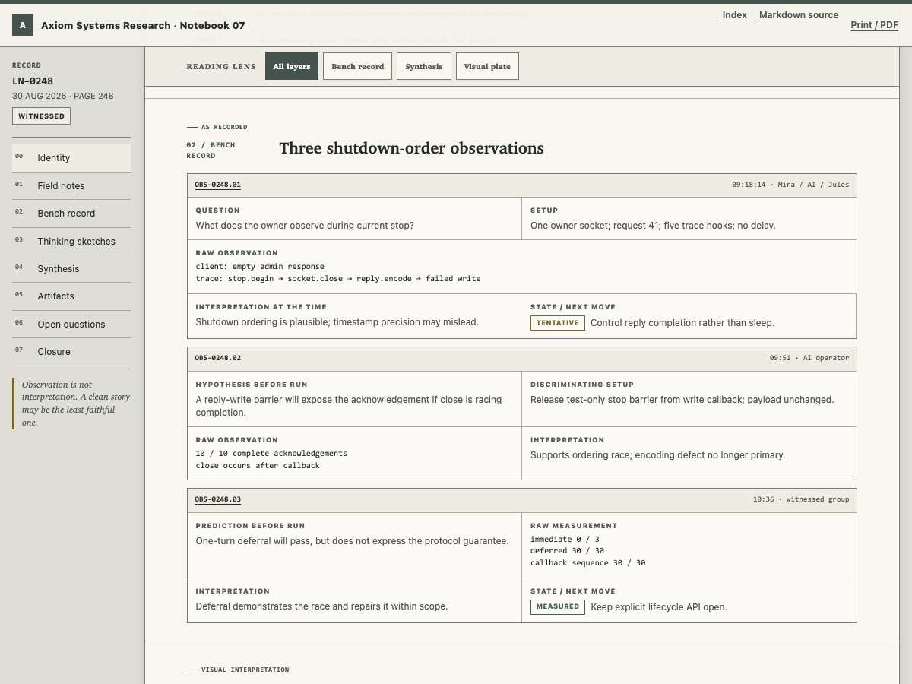

# Lab Journal

A file-only engineering notebook for humans and AI agents. Markdown preserves
the complete record; optional HTML plates use the full expressiveness of the web
when chronology, topology, measurements, sketches, provenance, or corrections
are easier to understand visually.

[Install the notebook](#install-in-another-project) ·
[Read a compact entry](starter-kit/lab-journal/examples/2026-09-06-routine-link-fix.md) ·
[Explore the experiment plate](starter-kit/lab-journal/examples/2026-08-30-reply-before-close.html)



A routine entry can be short. This excerpt comes from the
[complete synthesized Markdown-only example](starter-kit/lab-journal/examples/2026-09-06-routine-link-fix.md):

> **Question:** Does the help link work when the notebook is opened from disk?
> **Prediction, before test:** If the guide exists and the path is the fault,
> changing only the href to `AUTHORING.md` will open the neighboring guide.
> **Observed:** Before: file not found. After: the authoring guide opens.
> **Decision:** Keep the relative path; the notebook must travel with its folder.

## The whole runtime is a folder

Authoring requires no server, generator, framework, package installation,
validator, network connection, or build step. An agent reads the reporting
guide and templates, then writes ordinary `.md` and `.html` files directly.

The HTML pages use relative local assets, open through `file://`, remain complete
without JavaScript, and print the full record. Markdown is always canonical and
must stand alone.

**Print / PDF** requests the browser's print dialog, where you can choose Save
as PDF. Embedded viewers may not support that dialog; the control shows fallback
instructions. It does not download a file automatically. Saved-PDF links in the
real-content review are explicitly labelled snapshots.

## Install in another project

### 1. Copy the clean notebook

Copy [`starter-kit/lab-journal/`](starter-kit/lab-journal/) into the root of
your project as `lab-journal/`:

```text
your-project/
└── lab-journal/
    ├── LICENSE
    ├── AUTHORING.md
    ├── COMPACT-TEMPLATE.md
    ├── TEMPLATE.md
    ├── PLATE-TEMPLATE.html
    ├── index.md
    ├── index.html
    ├── assets/
    ├── attachments/
    └── examples/
```

This is a clean notebook with zero live entries. There is nothing to reset or
generate. If the project already has a notebook, use its installed protocol;
do not overwrite it with the starter.

### 2. Tell the agent where the protocol lives

Merge one short adapter into the project instructions your environment reads.
Do not replace existing project instructions.

- [`AGENTS.md` adapter](starter-kit/agent-instructions/AGENTS.md) for Codex,
  Grok Build, and other `AGENTS.md` environments.
- [`CLAUDE.md` adapter](starter-kit/agent-instructions/CLAUDE.md) for Claude Code.
- [Generic instruction block](starter-kit/agent-instructions/GENERIC.md) for
  environments with custom project rules.

The adapters deliberately contain only a pointer and the essential trigger.
The single authoritative protocol remains inside
`lab-journal/AUTHORING.md`.

### 3. Record notebook adoption

The installation changes the project's working protocol, so it should become
the first live record. Create `LN-0001` from `TEMPLATE.md`, state that the
notebook was adopted, link the copied protocol and project-instruction change,
and update both indexes. Mark the copy and adapter steps as reconstructed when
they happened before the entry was opened; never invent their timestamps.

That completes installation. Subsequent work that changes code, specifications,
experiments, or design decisions maintains its record as part of the work. No
command needs to be installed or run.

## What the agent does

1. Reads `AUTHORING.md`, the appropriate Markdown template, both indexes, the
   previous entry, related open questions and project instructions.
2. Creates the next unused live entry before work, or resumes an unsigned entry
   for the same ongoing work. Earlier work is explicitly reconstructed from
   named sources; predictions are never backdated.
3. Appends observations, hypotheses, predictions, measurements, failures, and
   decisions in event order.
4. Creates a same-basename HTML plate directly from `PLATE-TEMPLATE.html` when a
   visual relationship materially helps. HTML is authored, not generated from
   Markdown.
5. Updates `index.md` and `index.html`, linking Markdown always and HTML only
   when it exists.
6. Performs the applicable closing review, records checks and limitations,
   signs its own role, and reports the record links and unresolved questions.

### How to tell whether the agent did this well

The entry should answer: what question was investigated, what was expected
before the check, what actually happened, which evidence supports the conclusion,
what failed or changed, and what remains unknown. A routine implementation can
use a practical expectation; it need not invent a scientific hypothesis.

Expect named checks with actual outcomes and evidence, not just “tests passed.”
Unknown timestamps and missing artifacts stay explicit. A user request does not
make the user a witness. Markdown-only work needs no HTML checks; an unavailable
check must be reported as unverified. The notebook adds no toolchain, but does
not waive the project's normal tests. Instructions guide behavior; structural
validation alone cannot guarantee the quality of an agent's reasoning.

For the first task after installation, you can say:

```text
Follow lab-journal/AUTHORING.md while doing this task. Start or resume the
appropriate record before acting, keep evidence as you work, and report the
Markdown link, checks actually performed, limitations and open questions.
```

## Two authoring paths

### Markdown only

Use this for routine work or whenever prose and tables communicate the evidence
well. Use `COMPACT-TEMPLATE.md` for one bounded routine question, or
`TEMPLATE.md` for a fuller experiment. Author the record and update both indexes. The HTML
index links to Markdown and states that no companion plate exists.

### Markdown plus HTML

Use this for chronology, measured comparison, system maps, conjecture-versus-
measurement sketches, failure families, annotated evidence, or corrective
diffs. Copy `PLATE-TEMPLATE.html` to the Markdown entry's basename and select
one to three evidence-bearing forms.

The shared dense bench-sheet language is quiet, compact, responsive, accessible,
and print-minded. It should feel like a serious laboratory instrument rather
than a themed blog or presentation deck.

## Optional cross-agent skill

[`skills/lab-journal/`](skills/lab-journal/) packages the same workflow as a
standards-based `SKILL.md` bundle for agent environments that support skills.
It can initialize the clean static kit or operate an existing notebook using the
agent's normal file tools. The installed project remains self-contained and does
not depend on the skill afterward.

The skill is a convenience layer, not the product. Teams that do not use skills
receive the same notebook behavior from the project instruction adapter.

## What this preserves

The original Markdown workflow from `master` remains intact:

- permanence through append-only entries and explicit corrections;
- immediacy through contemporaneous field notes;
- self-contained records that survive changing agents and tools;
- hypotheses and predictions recorded before measurements;
- failures and rejected paths retained as evidence;
- signatures, witnesses, provenance, and durable links.

The richer system adds stable observation, artifact, question, figure, and
correction IDs; a searchable static HTML index; optional visual plates; and a
professional shared visual grammar.

## Examples

The starter includes three explicitly synthesized specimens:

- [Compact Markdown-only repair](starter-kit/lab-journal/examples/2026-09-06-routine-link-fix.md),
  using the compact template for a single bounded change.

- [Layered experiment](starter-kit/lab-journal/examples/2026-08-30-reply-before-close.html)
  with its [canonical Markdown](starter-kit/lab-journal/examples/2026-08-30-reply-before-close.md).
- [Append-only correction](starter-kit/lab-journal/examples/2026-09-04-timeout-was-witness.html)
  with its [canonical Markdown](starter-kit/lab-journal/examples/2026-09-04-timeout-was-witness.md).

### Install the optional skill

Copy the complete `skills/lab-journal/` directory into one discovery location.
The destination must contain `lab-journal/SKILL.md`, not only the Markdown file.

| Agent host | Project-scoped location | User-scoped location | Invoke or verify |
|---|---|---|---|
| Codex | `.agents/skills/lab-journal/` | `~/.agents/skills/lab-journal/` | Mention `$lab-journal`; `/skills` lists discovered skills |
| Claude Code | `.claude/skills/lab-journal/` | `~/.claude/skills/lab-journal/` | Invoke `/lab-journal` or ask Claude to use the lab-journal skill |
| Grok Build | `.grok/skills/lab-journal/` | `~/.grok/skills/lab-journal/` | Invoke `/lab-journal`; `grok inspect` reports discovery |

These locations follow the current [Codex skill documentation](https://developers.openai.com/codex/skills),
[Claude Code skill documentation](https://code.claude.com/docs/en/slash-commands),
and [Grok Build skill documentation](https://docs.x.ai/build/features/skills-plugins-marketplaces).
Restart the host if a newly copied skill does not appear.

For a repository installation, check in the skill directory so every agent sees
the same version. For a personal installation, the skill can initialize many
projects, but each installed notebook remains independent afterward.

### Verification status

- The exact bundle passes the official structural skill validator.
- Codex CLI 0.153.4 completed actual initialization, a routine repair, and a
  full append-only correction in an isolated project. Both protected originals
  remained byte-identical; generated entries correctly limited the check to
  file existence and did not claim browser verification.
- Grok Build discovered and read the project skill and bundled protocol.
  Three headless authoring attempts cancelled at command execution; no completed
  authoring result is claimed.
- Claude Code's actual attempt returned an organization access-policy 403.
  Initialization and authoring remain unverified (Q-0008-02).
- See the [retained host smoke evidence](docs/reviews/host-smoke/README.md) for
  commands, tested bundle hashes, generated records and limitations. Discovery
  and shared format support are distinct from successful end-to-end authoring.

## Developing this repository

The npm, Playwright, Chromium/Firefox/WebKit, Docker, visual-baseline, accessibility, and static
validation machinery in this repository is solely for maintainers of the
templates and shared design language. It is not copied into projects and is not
part of authoring.

See [`CONTRIBUTING.md`](CONTRIBUTING.md) for the maintainer setup and release
gate.

## Repository map

| Path | Audience | Purpose |
|---|---|---|
| `starter-kit/` | Notebook users and agents | Clean, ready-to-copy, file-only notebook and instruction adapters |
| `skills/lab-journal/` | Skill-capable agents | Optional portable adapter with the same clean starter as assets |
| `lab-journal/` | This repository's maintainers | The project's own live notebook and canonical shared design sources |
| `CONTRIBUTING.md` | Maintainers | Development dependencies, QA, release, and baseline review |
| `tests/`, `scripts/`, `package*.json` | Maintainers | Distribution integrity and browser-based quality control |

## Current full-format reference

[LN-0251: scope correction with complete identity, evidence, ownership and closure](starter-kit/lab-journal/examples/2026-09-06-instrumentation-scope-correction.md).
The older experiment/correction pair is historical specimen content with dated
amendments; use the current reference for new full records.

## Reference

Kanare, Howard M. *Writing the Laboratory Notebook.* American Chemical Society,
1985. ISBN 978-0-8412-0906-4.
